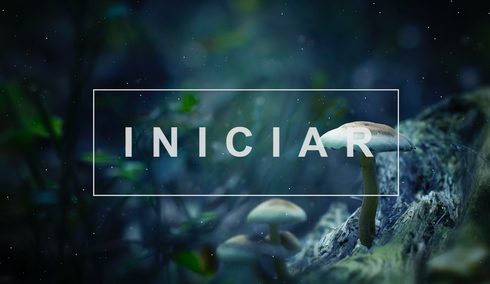

# Mushroom Classification 🍄

This repo is dedicated to our AI homework. Its goal is to perform some AI task with a given dataset, in this case we have chosen Classification as our task.

Objective: classify if a mushroom is edible or poisonous based on its characteristics (color, shape, rings etc).

Dataset: agaricus-lepiota.data from https://archive.ics.uci.edu/ml/datasets/Mushroom

Classification: the algorithm used to classify the mushrooms is Naïve Bayes.

## Running
You just have to open index.html file in order to use this application.